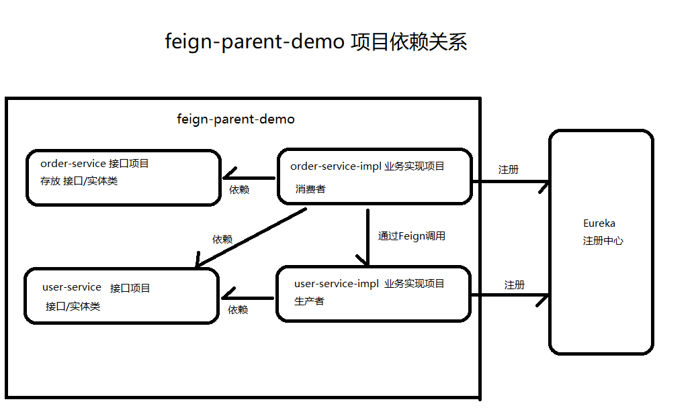

## Feign调用的重构
　　之前的代码中, 生产者定义被调用的接口, 消费者使用Feign调用时也要重新写一个完全一样的接口造成代码重复, 以后的迭代更新就要同时修改调用与被调用的接口, 徒增很多工作量, 为了避免此类事情发生可将项目重构.  
　　重构后项目分为四个模块  
- order-service
- order-service-impl
- user-service 
- user-service-impl
 项目间的依赖关系入下图:  
 
 
> 　　order-service-impl依赖user-service项目, 是为了使用feign客户端调用时避免写重复代码, 只要在order-service-impl中定义接口然后继承user-service中的接口, 再加上@FeignClient即可  
> 　　user-service中被Feign调用的接口要加@RequestMapping(@GetMapping/@PutMapping)注解
